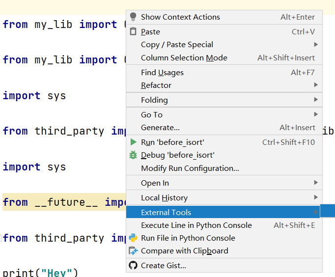
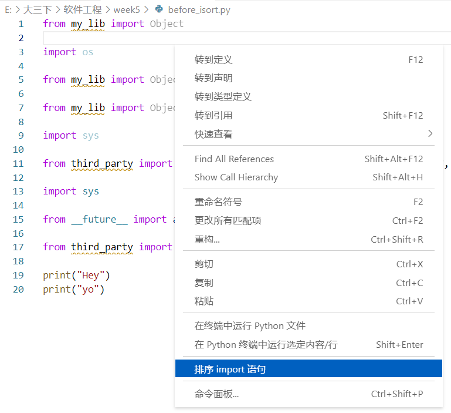
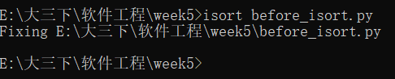
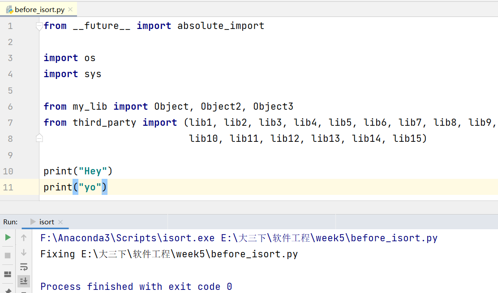

# Python的isort包的使用
## 一、isort包介绍
isort包可以自动对Python文件的import语句进行排序，并自动按类型(标准库、第三方库、自己的模块等)进行分段。

## 二、Python中isort包的使用
1. 在命令行进行使用  

使用命令以下命令对具体的pthonflie.py文件的import部分进行排序和分段

```
isort pythonflie.py
```
2. 在Python内使用

```Python
import isort
isort.file('pythonflie.py')
```

3. 在Python集成开发平台使用
- 在Pycharm中通过设置添加isort外部工具，在Python文件的编辑窗口，鼠标右键弹出菜单的外部工具中选择isort进行排序  

- 在VSCode中设置python sort imports，在Python文件的编辑窗口，鼠标右键弹出菜单中选择“排序import语句”  

## 三、命令行详细使用——选项列表

在命令行使用isort命令时，可进行多种选项设置，isort [a],例如可以选择以下选项a：
| 选项 | 描述 |
| :--------:|:---:|
|-h,--help|可以提供帮助信息，可以作为参考指南，进行查询|
|-q,--quiet|显示更少的输出，仅输出错误信息|
|-v,--version|显示当前安装的isort的版本|
|--show-files|查看在当前选项下，哪些文件会被isort处理|
|--df,--diff|显示isort将对一个文件做的修改，但并未修改文件|
|-c, --check-only,--check|检查文件中是否存在未排序的import，并将其打印到命令行，但并未修改文件|
|--ac, --atomic|如果生成的文件中包含语法错误，则确保不会保存并输出|

## 四、使用isort包对before_isort.py包进行排序
1. 使用命令行  



2. 使用Pycharm外部工具中安装的isort



可以看出使用isort包后，文件的import进行了重新的排序和分段。


